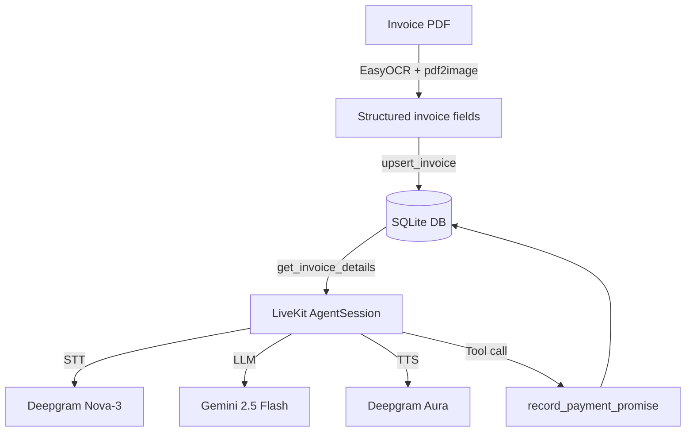

#  Smart Accounts Receivable (AR) Voice Agent

## What this project demonstrates

- LiveKit Agents worker for WebRTC voice conversations
- Gemini LLM reasoning through the LiveKit Google plugin
- Deepgram STT/TTS for speech input and output
- Silero VAD for interruption-friendly turn handling
- EasyOCR + pdf2image invoice OCR pipeline
- SQLite persistence for invoice status and promised payment dates
- Docker-ready deployment

---

##  Live Demo & Pitch
Instead of observer dashboards, this project is a fully autonomous **agentic workflow**. It extracts overdue invoice details using OCR, syncs them to a stateful database, and triggers a real-time, WebRTC-based phone-style voice call to negotiate payments with customers.

*   **Watch the 2-minute walkthrough & live call demo:**  
    [](YOUR_LOOM_VIDEO_URL_HERE)

---

##  System Architecture

The pipeline consists of three core engineering blocks, designed for maximum efficiency and sub-second voice latency:



## Setup

##  Features & Technical Highlights

*   High-Fidelity OCR Ingestion: Uses `pdf2image` and `EasyOCR` to convert documents on-the-fly and run regex heuristics to extract Invoice IDs, Customer Names, Due Dates, and Balances.
*    Stateful Business Logic: Uses a localized `SQLite` database to fetch live invoice data, ensure the agent has accurate financial context, and record payment promise dates.
*    Sub-Second Audio Latency: Orchestrated using **LiveKit Agents 1.6.0** WebRTC infrastructure, Deepgram STT, and Deepgram Aura TTS, dropping latency under 800ms.
*    Advanced Interruption Handling: Employs `Silero VAD` (Voice Activity Detection) inside the pipeline, allowing the customer to talk over the agent naturally.
*    Phonetic TTS Formatting: Contextual prompts instruct the LLM to write numbers and codes phonetically (e.g. spelling out `"I N V two zero..."` and speaking `"four thousand dollars"` instead of symbols) to eliminate voice synthesis errors.
*    Containerized & Cloud-Ready: Deployed 24/7 on **Hugging Face Spaces** using a custom `Dockerfile` containing all dependencies (including Poppler system binaries).

- Windows: install Poppler and add the `bin` folder to PATH
- macOS: `brew install poppler`
- Linux: `sudo apt-get install poppler-utils`

##  Project Directory Structure

```bash
python -m venv .venv
.venv\Scripts\activate  # Windows PowerShell: .venv\Scripts\Activate.ps1
pip install -r requirements.txt
```

### 3. Configure environment

##  Local Quickstart

### 1. Install System Dependencies
The PDF-to-Image OCR pipeline requires **Poppler**:
*   Windows: Download binaries from [poppler-windows](https://github.com/oschwartz10612/poppler-windows/releases), extract, and add the `bin` folder to your System PATH variables.
*   **Mac:** `brew install poppler`
*   **Linux:** `sudo apt-get install poppler-utils`

### 2. Set Up the Project
```bash
copy .env.example .env  # Windows
# or
cp .env.example .env    # macOS/Linux
```

Fill in:

```env
LIVEKIT_URL=wss://your-project-id.livekit.cloud
LIVEKIT_API_KEY=APIxxxxxxxxx
LIVEKIT_API_SECRET=secxxxxxxxxx
GOOGLE_API_KEY=AIzaSyxxxxxxxxxxxxxxxxxxxxxxxxxxxx
DEEPGRAM_API_KEY=xxxxxxxxxxxxxxxxxxxxxxxxxxxxxxxx
```

### 4. Initialize database

```bash
python database.py
```

### 5. Run locally

```bash
python voice_agent.py dev
```

Then connect from a LiveKit room/client and speak to the agent.

## OCR usage

Place an invoice PDF in the project folder and run:

```bash
python ocr_extractor.py
```

For app integration, call:

```python
from database import upsert_invoice
from ocr_extractor import extract_invoice_data

invoice = extract_invoice_data("invoice_sample.pdf")
upsert_invoice({**invoice, "status": "OVERDUE"})
```

## Main fixes in this version

- Restored proper newlines/formatting in every source/config file
- Fixed invalid `requirements.txt`, `.env.example`, `.gitignore`, and `Dockerfile`
- Added DB auto-initialization and safe schema migration
- Added promise-date persistence
- Replaced hard-coded invoice details in the voice prompt with database values
- Added TTS-safe formatting for invoice IDs and money amounts
- Added a LiveKit function tool for recording payment promises
- Made OCR parsing testable without running EasyOCR
