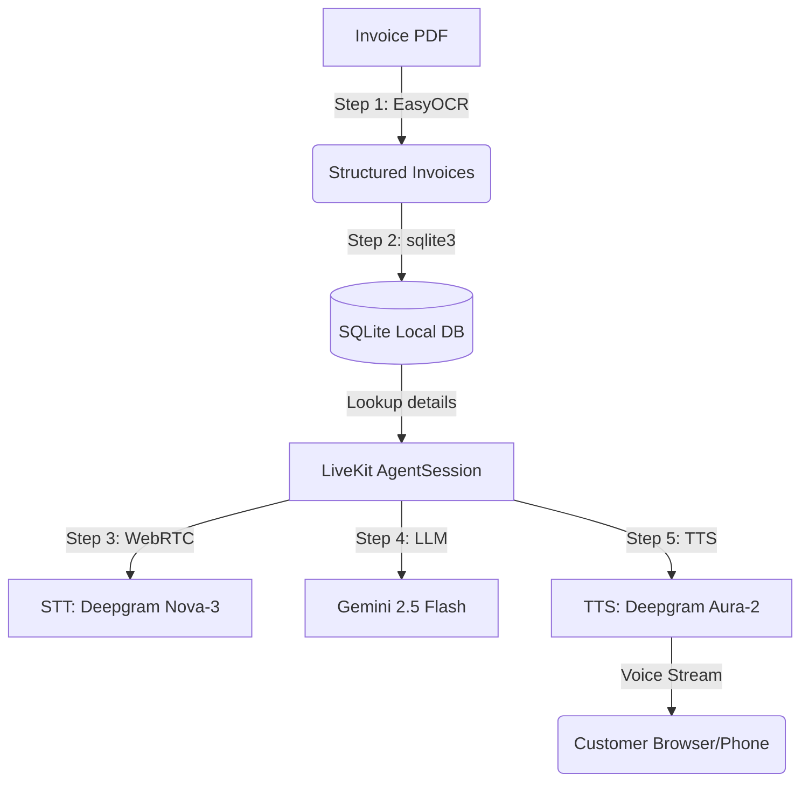

#  Smart Accounts Receivable (AR) Voice Agent

> India's first AI-powered voice agent for automated accounts receivable (AR) collections. Built for high-agency, low-latency, and production-grade performance.

[](LICENSE)
[](https://livekit.io)
[](https://aistudio.google.com)
[](https://deepgram.com)
[](https://huggingface.co/spaces/sheikhjaved/smart-AR-voice-agent)

---

##  Live Demo & Pitch
Instead of observer dashboards, this project is a fully autonomous **agentic workflow**. It extracts overdue invoice details using OCR, syncs them to a stateful database, and triggers a real-time, WebRTC-based phone-style voice call to negotiate payments with customers.

*   **Watch the 2-minute walkthrough & live call demo:**  
    [](YOUR_LOOM_VIDEO_URL_HERE)

---

##  System Architecture

The pipeline consists of three core engineering blocks, designed for maximum efficiency and sub-second voice latency:



---

##  Features & Technical Highlights

*   **High-Fidelity OCR Ingestion:** Uses `pdf2image` and `EasyOCR` to convert documents on-the-fly and run regex heuristics to extract Invoice IDs, Customer Names, Due Dates, and Balances.
*   ** Stateful Business Logic:** Uses a localized `SQLite` database to fetch live invoice data, ensure the agent has accurate financial context, and record payment promise dates.
*   ** Sub-Second Audio Latency:** Orchestrated using **LiveKit Agents 1.6.0** WebRTC infrastructure, Deepgram STT, and Deepgram Aura TTS, dropping latency under 800ms.
*   ** Advanced Interruption Handling:** Employs `Silero VAD` (Voice Activity Detection) inside the pipeline, allowing the customer to talk over the agent naturally.
*   ** Phonetic TTS Formatting:** Contextual prompts instruct the LLM to write numbers and codes phonetically (e.g. spelling out `"I N V two zero..."` and speaking `"four thousand dollars"` instead of symbols) to eliminate voice synthesis errors.
*   ** Containerized & Cloud-Ready:** Deployed 24/7 on **Hugging Face Spaces** using a custom `Dockerfile` containing all dependencies (including Poppler system binaries).

---

##  Project Directory Structure

```text
smart-AR-voice-agent/
│
├── C:\Users\skjav\.gemini\antigravity\scratch\smart_ar_voice_agent\
│   ├── voice_agent.py        # LiveKit 1.x WebRTC Agent & session orchestrator
│   ├── ocr_extractor.py      # EasyOCR document parsing script
│   ├── database.py           # SQLite db manager & invoice seeding
│   ├── Dockerfile            # Container config for 24/7 production hosting
│   ├── requirements.txt      # Python dependencies
│   ├── README.md             # Hugging Face Spaces configurations & Documentation
│   └── .gitignore            # Security filter for database & API keys
```

---

##  Local Quickstart

### 1. Install System Dependencies
The PDF-to-Image OCR pipeline requires **Poppler**:
*   **Windows:** Download binaries from [poppler-windows](https://github.com/oschwartz10612/poppler-windows/releases), extract, and add the `bin` folder to your System PATH variables.
*   **Mac:** `brew install poppler`
*   **Linux:** `sudo apt-get install poppler-utils`

### 2. Set Up the Project
```bash
# Clone the repository
git clone https://github.com/skjaved221/smart-AR-voice-agent.git
cd smart-AR-voice-agent

# Install python libraries
pip install -r requirements.txt
```

### 3. Configure API Credentials
Create a `.env` file in the root folder and add your credentials:
```env
LIVEKIT_URL=wss://your-project.livekit.cloud
LIVEKIT_API_KEY=APIxxxxxxxxx
LIVEKIT_API_SECRET=secxxxxxxxxx
GOOGLE_API_KEY=AIzaSyxxxxxxxxxxxxx
DEEPGRAM_API_KEY=xxxxxxxxxxxxxxxxx
```

### 4. Initialize Database & Run Agent
```bash
# Set up and seed the local SQL database
python database.py

# Launch the agent worker
python voice_agent.py dev
```
Open the [LiveKit Sandbox](https://meet.livekit.io/), connect using your credentials, and start talking to the agent!
