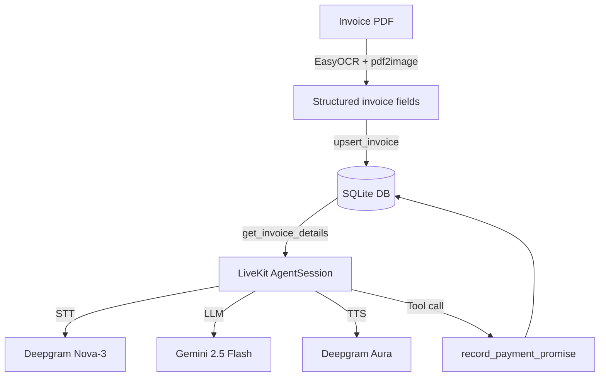

# Smart Accounts Receivable (AR) Voice Agent

An AI-powered voice agent for automated accounts receivable collections. It extracts invoice data, stores invoice state in SQLite, and uses LiveKit + Gemini + Deepgram for a realtime voice workflow.

## What this project demonstrates

- LiveKit Agents worker for WebRTC voice conversations
- Gemini LLM reasoning through the LiveKit Google plugin
- Deepgram STT/TTS for speech input and output
- Silero VAD for interruption-friendly turn handling
- EasyOCR + pdf2image invoice OCR pipeline
- SQLite persistence for invoice status and promised payment dates
- Docker-ready deployment

## Architecture



## Setup

### 1. Install system dependency

The OCR pipeline needs Poppler.

- Windows: install Poppler and add the `bin` folder to PATH
- macOS: `brew install poppler`
- Linux: `sudo apt-get install poppler-utils`

### 2. Install Python dependencies

```bash
python -m venv .venv
.venv\Scripts\activate  # Windows PowerShell: .venv\Scripts\Activate.ps1
pip install -r requirements.txt
```

### 3. Configure environment

```bash
copy .env.example .env  # Windows
# or
cp .env.example .env    # macOS/Linux
```

Fill in:

```env
LIVEKIT_URL=wss://your-project-id.livekit.cloud
LIVEKIT_API_KEY=APIxxxxxxxxx
LIVEKIT_API_SECRET=secxxxxxxxxx
GOOGLE_API_KEY=AIzaSyxxxxxxxxxxxxxxxxxxxxxxxxxxxx
DEEPGRAM_API_KEY=xxxxxxxxxxxxxxxxxxxxxxxxxxxxxxxx
```

### 4. Initialize database

```bash
python database.py
```

### 5. Run locally

```bash
python voice_agent.py dev
```

Then connect from a LiveKit room/client and speak to the agent.

## OCR usage

Place an invoice PDF in the project folder and run:

```bash
python ocr_extractor.py
```

For app integration, call:

```python
from database import upsert_invoice
from ocr_extractor import extract_invoice_data

invoice = extract_invoice_data("invoice_sample.pdf")
upsert_invoice({**invoice, "status": "OVERDUE"})
```

## Main fixes in this version

- Restored proper newlines/formatting in every source/config file
- Fixed invalid `requirements.txt`, `.env.example`, `.gitignore`, and `Dockerfile`
- Added DB auto-initialization and safe schema migration
- Added promise-date persistence
- Replaced hard-coded invoice details in the voice prompt with database values
- Added TTS-safe formatting for invoice IDs and money amounts
- Added a LiveKit function tool for recording payment promises
- Made OCR parsing testable without running EasyOCR
